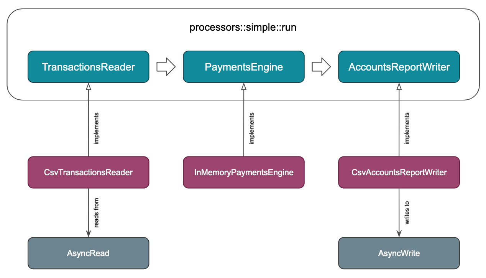
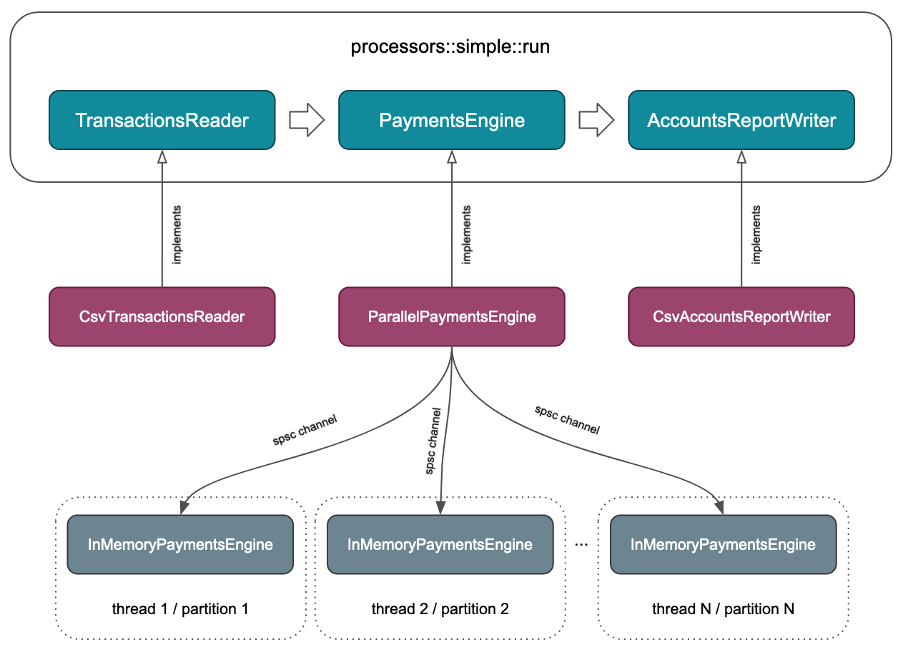

# Toy Payments Engine

This is a toy project to test my Rust skills with a simple use case and certain time constraints.

## Assumptions

There are some aspects of the specification that were not fully clear, so I had to make some assumptions:

- Disputes can be done over deposits and withdrawals.
- A dispute over a deposit will retain a positive amount from the available funds into the held funds:
  `{ available: 100, held: 0, total: 100 } --[dispute of deposit of 10]--> { available: 90, held: 10, total: 100 }`
- A dispute over a withdrawal will retain a negative amount from the held funds into the available funds (that was a confusing point):
  `{ available: 100, held: 0, total: 100 } --[dispute of withdrawal of 10]--> { available: 110, held: -10, total: 100 }`
- A multi-threading solution would have provided better performance for single file executions and in memory processing in theory, but I prioritized a modular end to end setup with async/await and tokio/stream that would fit better in an scenario where each batch of payments were processed through different HTTP requests, and left the multi-threading solution as a future enhancement.
- To guarantee decimal precision I use the crate `rust_decimal` which can handle more than the specified precision of four places at the cost of using 128 bits per number.
- The payments engine logic is able to encode all kind of situations as errors, but the current processor implementation will ignore them and continue processing. This is intentional to follow the specifications, but at the same time to leave open the possibility to use that information as events for a fraud system or observability purposes.

## Software design

I've followed some simple design principles with the aim of:

- decoupling the domain logic to process payments from the other system concerns, such as reading or writing data from/to CSVs.
- making the system flexible and composable to be able to adapt it to different scenarios (HTTP streaming, multi-threading, ...).

The code is divided in three modules:

- [io](src/io): Containing all the logic needed to read transactions from CSVs (see [CsvTransactionsReader](src/io/reader.rs)) and writing account reports to CSVs (see [CsvAccountsReportWriter](src/io/writer.rs)).
- [payments](src/payments): Containing the domain logic to process payment transactions (see [InMemoryPaymentsEngine](src/payments/engine.rs)).
- [processors](src/processors): Containing the glue logic to read the transactions, run all the processing, and generate the final report (see [run](src/processors/simple.rs)).

The overall architecture looks like:



## Limitations and future plans

I focused on having an end to end that could show the full solution working, and was easily adapted to the scenario of processing payments as micro-batches through HTTP or some other network protocol (mostly IO bound). My plan was to add multi-threading capabilities after that, but then I realized that it would be completely out of time, so I ended having an async solution that might not show the best performance in the automated tests, where only one file is processed per run, and the in-memory implementation of payments is mostly CPU bound.

The idea to introduce multi-threading was to keep the async code as it is, but build an advanced implementation of the trait `PaymentsEngine` that would launch multiple threads, with one independent `InMemoryPaymentsEngine` instance per thread. The transactions would be partitioned using a uniform hash over the `client_id` and sent to the corresponding thread for processing using a channel. That way, all the transactions for a certain client would always go to the same thread, while keeping the load distributed across all the worker threads. At the end all the individual reports would be gathered and merged.



Also, due to lack of time, I couldn't implement benchmarks with `criterion` to see how all those solutions perform under different conditions (small vs big files, async-only vs multi-thread).

## Security considerations

- Not dealing only with happy paths, but caring about exceptional cases as a norm. I use different error handling strategies:
  - Using `thiserror` to be able to identify very specific error conditions in the payments engine.
  - Using `anyhow` in the situations where there is no need to distinguish between different causes in the code, but just to know whether things went ok or not and be able to log some textual information.
- Carefully tested scenarios: I tried to cover all the possible paths with unit tests and some integration tests. I didn't spend so much time with test files, as all the parts were covered in isolation and integrated.
- Resilience of the processing: Even if the payments engine is able to discriminate between all kind of error conditions, the overall processor will be resilient to errors like wrong CSV row formats, or violation of some business rules for an specific client, and continue processing as much as possible. Only when the underlying IO fails it will stop and report.
- Fixed dependencies versions: to avoid unexpected upgrades, and introduction of non audited versions, with new automated builds.
- Use of `rust_decimal` to handle money quantities, to avoid loosing money because of rounding problems.
- I was tempted to use a faster hash algorithm for the `HashMap`s used in the `InMemoryPaymentsEngine`, but decided to stick with the Rust defaults which provide resistance against HashDoS attacks.

## Development

To generate documentation from the commented code:

```
cargo doc --open
```

To run the processor using a file:

```
cargo run --release -- transactions.csv >output.csv
```

It is also possible to pipe the input like:

```
cargo run --release <transactions.csv >output.csv
```

The code can be formatted and linted like:

```
cargo fmt
cargo clippy --all-targets -- -D warnings
```